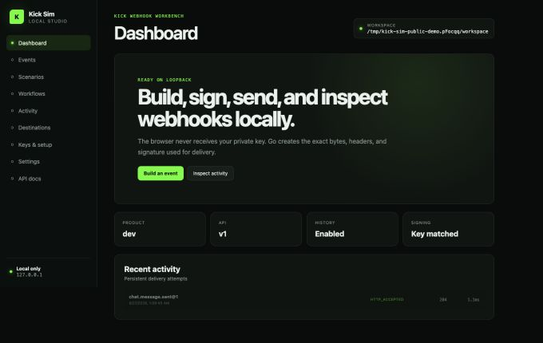

# kick-sim

[](https://github.com/egekocabas/kick-sim/actions/workflows/ci.yml)
[](https://github.com/egekocabas/kick-sim/releases)
[](LICENSE)

An unofficial, local-only simulator for building and testing [Kick](https://kick.com/) webhook integrations without OAuth, live subscriptions, or requests to Kick.

> [!IMPORTANT]
> Kick Sim is a pre-1.0 development tool. It is not affiliated with, endorsed by, or operated by Kick. Simulator signatures must never be trusted in production.



## What it does

- Generates schema-validated Kick webhook payloads from reviewed, versioned contracts.
- Signs the exact request body with a workspace-local RSA key.
- Delivers only to loopback HTTP(S) receivers and refuses redirects.
- Runs reusable single-event scenarios, timelines, and assertion suites.
- Retains bounded local delivery history for inspection and deterministic replay.
- Provides a CLI for scripts and CI plus an embedded browser-based Studio.
- Never contacts Kick or exposes the simulator private key to the browser.

Bundled contracts currently cover `channel.followed`, `chat.message.sent`, `livestream.status.updated`, and `moderation.banned` version 1 events.

## Install

Prebuilt archives are available for macOS and Linux (`amd64`, `arm64`) and Windows (`amd64`) on the [Releases page](https://github.com/egekocabas/kick-sim/releases). Releases are currently marked as pre-releases. Verify the downloaded archive against `checksums.txt`, extract it, and place `kick-sim` on your `PATH`.

To build the embedded Studio from source, install:

- Go 1.26.6
- Node.js 24.19.0
- npm 11.17.0

```sh
git clone https://github.com/egekocabas/kick-sim.git
cd kick-sim
npm ci --prefix web
make build
./dist/kick-sim --help
```

Use `./dist/kick-sim` in place of `kick-sim` in the examples below when running the source-built binary directly.

## Quick start

Create a local workspace in the current project:

```sh
kick-sim init
```

The generated configuration targets `http://127.0.0.1:3000/webhooks/kick`. When working from this repository, start the bundled verifying receiver in one terminal:

```sh
go run ./examples/receiver
```

Send it a signed built-in scenario from another terminal:

```sh
kick-sim scenario run builtin:chat/basic-message \
  --content "Hello from Kick Sim"
```

Then open the local Studio:

```sh
kick-sim studio
```

Studio listens on `127.0.0.1:4321`, opens your browser, and uses the same filesystem workspace and delivery history as the CLI.

## Common workflows

```sh
# Inspect the supported contracts and their upstream provenance.
kick-sim compatibility
kick-sim event list

# Generate JSON without delivering it.
kick-sim event generate chat.message.sent --content "Preview me"

# Validate authored definitions before running them.
kick-sim scenario validate builtin:workflows/complete-stream-session
kick-sim suite validate builtin:security

# Run a deterministic timeline or assertion suite.
kick-sim scenario run builtin:workflows/complete-stream-session
kick-sim suite run builtin:delivery

# Use stable machine-readable output in automation.
kick-sim --output json scenario list
```

Run `kick-sim <command> --help` for the complete command surface.

## Safety model

Kick Sim is deliberately constrained to local development:

- Studio accepts only explicit loopback listener addresses and exact host/origin checks.
- Webhook destinations must resolve to loopback addresses; redirects and URL credentials are rejected.
- Each workspace owns a simulator-only key pair. The private key remains on disk with restrictive permissions where supported.
- Mutating Studio API requests require a random per-process control token.
- Runtime history is bounded and stored separately from authored scenarios and suites.

See [SECURITY.md](SECURITY.md) for trust boundaries, data handling, and vulnerability reporting.

## Repository layout

```text
cmd/kick-sim/       CLI entrypoint
internal/app/       event generation, delivery, replay, and history orchestration
internal/events/    bundled contract registry, payload composition, and validation
internal/scenario/  authored scenarios and timeline definitions
internal/suite/     assertion suites
internal/studio/    loopback-only HTTP API and embedded Studio server
assets/             embedded contracts, scenarios, suites, and compatibility metadata
web/                React Studio and generated OpenAPI client
examples/receiver/  minimal signature-verifying webhook receiver
```

The filesystem remains the source of truth for authored data. Generated OpenAPI artifacts are committed and checked for drift in CI.

## Contracts and documentation

- [CLI contract](docs/cli-contract.md)
- [Workspace and authored-format contract](docs/workspace-contract.md)
- [Compatibility and provenance](docs/compatibility.md)
- [Security model](SECURITY.md)
- [Committed Studio OpenAPI document](web/openapi.json)

## Project status

The public CLI, JSON output, Studio API, workspace format, and authored scenario formats are versioned compatibility surfaces. The project is still pre-1.0, and releases may add new commands, fields, events, and capabilities while retaining the documented contracts.

This repository is currently published as a showcase and reference implementation. Bug reports are welcome, but unsolicited pull requests are not being accepted at this time. Please use private vulnerability reporting for security issues.

## License

[MIT](LICENSE) © 2026 Ege Kocabas.
